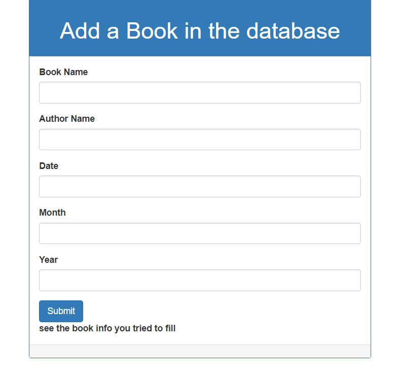
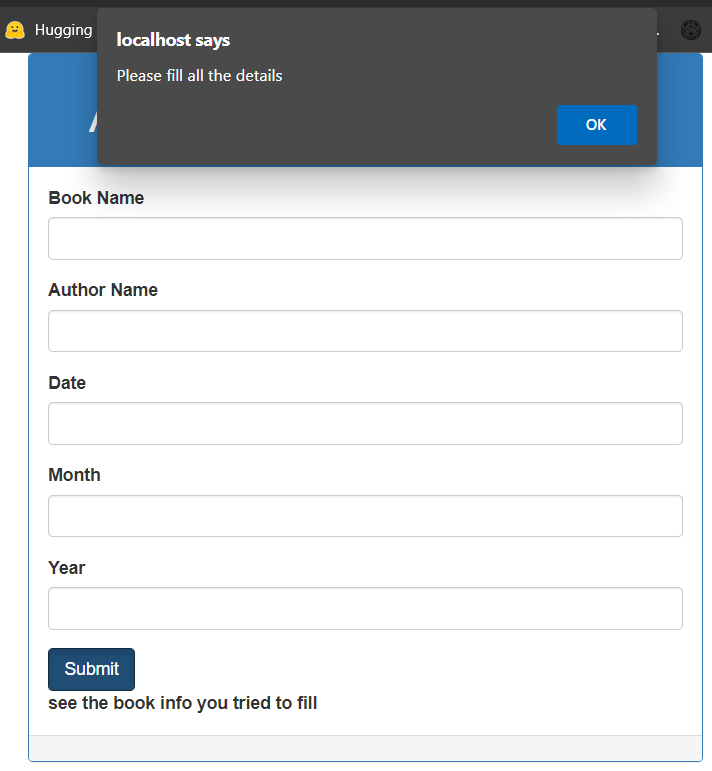
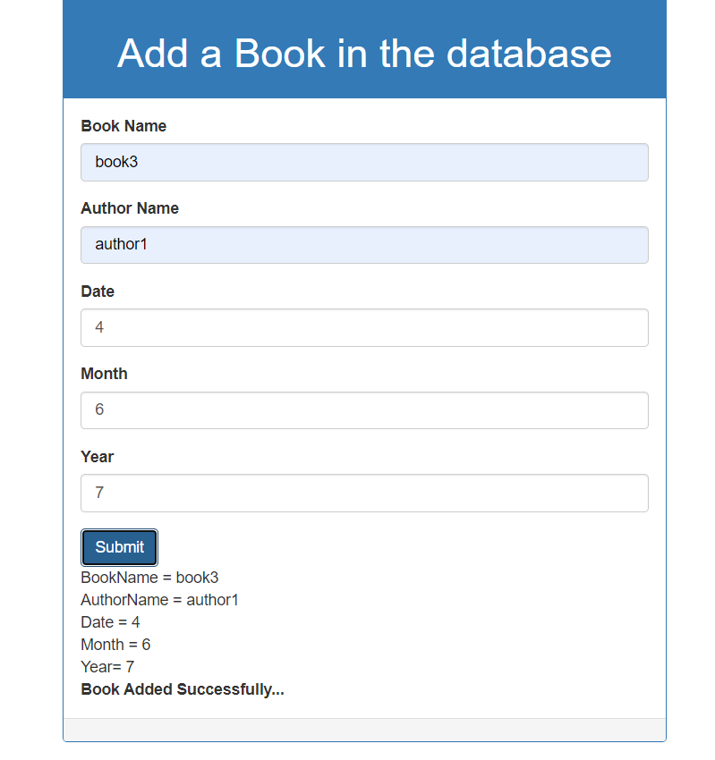
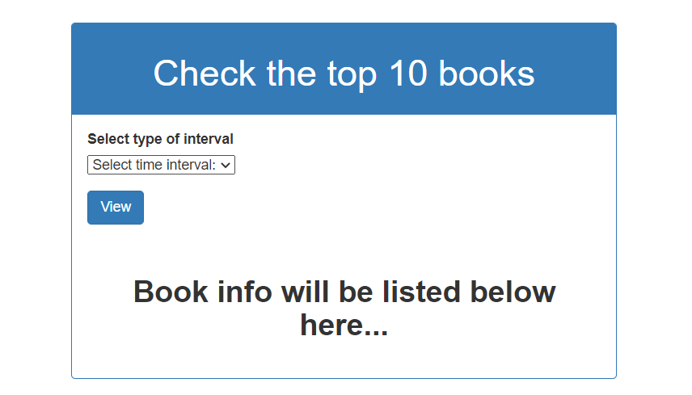
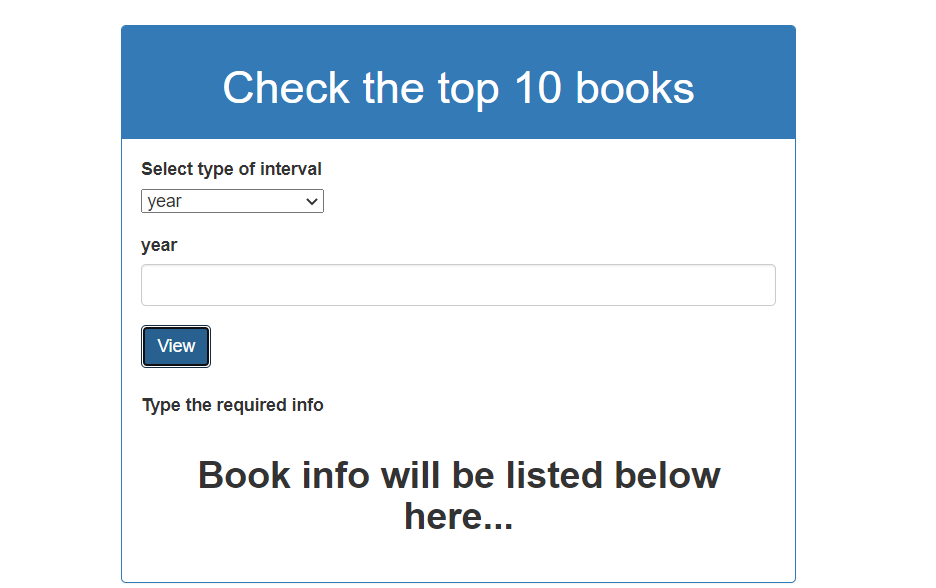
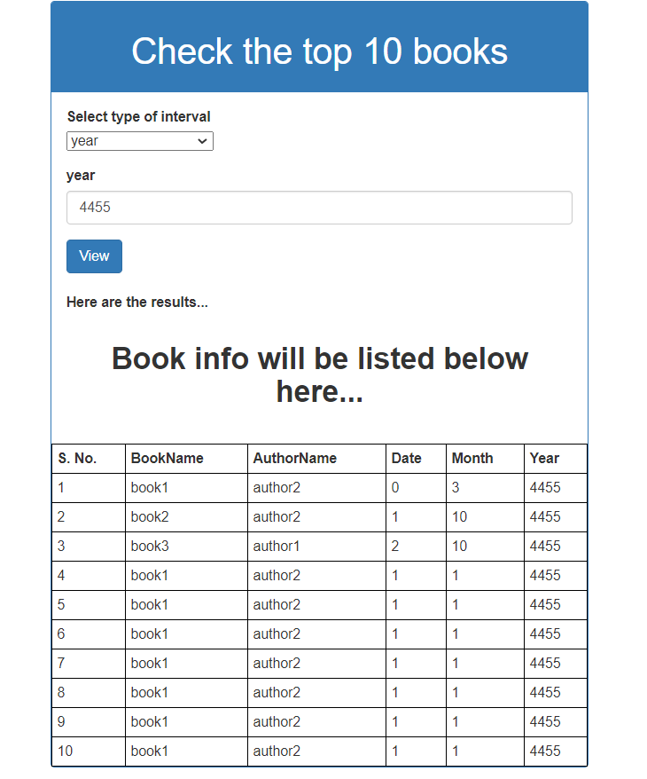

# BookDataManagment

## Insert a book

#### In this method, on onclick of button, it runs a javaScript function **mySubmit()** , which first validates the data filled, that is checks if any of the info is left blank, if left blank raises an alert.

#### then it goes to **connect.php** and insert the new data in the database, here **books** with table **booksdata**, and shows the data entered in the page also.

## View the Database

#### Here first we take a selector input which takes the type of interval user wants. On selecting the interval it runs a onchange javascript function **showOptions()** which unhide the further information which is needed to be filled accordingly.

#### if user selects year it asks for year, if user selects month if asks for month and year and similarly for date. Here again when user submits a javaScript function **showme()**, which first check whether any field is left empty, if it passes then it runs a php called **getinfo.php** which queries the database and outputs the top 10 books according to the query.

## Further Possible Additions

We can add a reset data button which clears the previous data filled in the inputs for both insertion and viewing.
